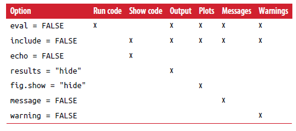

---
title: 'R Markdown'
author: "Statistical Programming in R"
date: ""
output:
  ioslides_presentation:
    logo: logo_en.png
    smaller: yes
    widescreen: no
    self_contained: true
    lib_dir: libs
  beamer_presentation:
    colortheme: beaver
---


```{r, include = F}

library(tidyverse)
library(magrittr)
library(knitr)
library(kableExtra)
library(mice)   

inline <- function(x = "") paste0("`` `r ", x, "` ``")

#knitr::opts_chunk$set(message = F, echo = F)


dt <- mtcars[1:5, 1:6]

options("kableExtra.html.bsTable" = T) #For kableExtra with ioslides

```


<!-- ## We use the following packages -->
<!-- ```{r, message=FALSE, warning=FALSE} -->
<!-- library(magrittr) # Pipes -->
<!-- library(ggplot2)  # Plotting suite -->
<!-- library(knitr) -->
<!-- library(kableExtra) -->
<!-- ``` -->


## R Markdown

**What is it**
* R Markdown is a file format for making dynamic documents

**Who is it for**
* For communicating to decision makers, who want to focus on the conclusions, not the code behind the analysis.

* For collaborating with other data scientists (including future you!), who are interested in both your conclusions, and how you reached them (i.e. the code).

* As an environment in which to do data science, as a modern day lab notebook where you can capture not only what you did, but also what you were thinking.


## Types of R Markdown output

* Documents (HTML, PDF, Word,  RTF, Markdown)
* Presentations 
  - ioslides (HTML) 
  - Beamer (PDF)
  - PowerPoint (PowerPoint)
* Journals
  - elsevier_article
  _ jss_article
* Dashboards
  - Flexdashboard
* Websites and blogs
  - blogdown
* Books
  - bookdown (HTML, PDF, ePUB and Kindle books)
  


## R Markdown code 

<center>

</center>


## What does R Markdown contains

It contains three important types of content:

* An (optional) YAML header surrounded by ---s.
* Chunks of R code surrounded by ```.
* Text mixed with simple text formatting like # heading and _italics_.

## How does R Markdown works

<center>

</center>

<br><br><br><br>
<br><br><br><br>


...but just push (ctrl+shift+K) the Knit icon.

# YAML

## YAML

YAML - "yet another markup language"

* Controls many "whole document" settings
* Possible to set document parameters 
* Possible to specify bibliography

RStudio creates a YAML header when starting from scratch with *File $\rightarrow$ New File $\rightarrow$ R Markdown...*

# Text

## Text

Examples 

* \*italic\*  gives *italic*
* \*\*bold\**  gives **bold**
* \~\~Strikethrough\~\~ gives ~~Strikethrough~~
* superscript\^2\^subscript\~2\~ gives superscript^2^/subscript~2~ 
* \$e\^{i\\pi}+1=0\$ gives $e^{i\pi}+1=0$
* `r inline('nrow(mice::boys)')` gives `r nrow(mice::boys)`
* 
Headers:

* \# Level 1 header
* \#\# Level 2 header

## Simple table

` Right | Left | Default | Center | `  
`|-------:|:------|-----------|:---------:|`   
`| 12 | 12 | 12 | 12 |`   
`| 123 | 123 | 123 | 123 | `  
`| 1 | 1 | 1 | 1 |`

Gives:

Right | Left | Default | Center | 
|-------:|:------|-----------|:---------:|   
| 12 | 12 | 12 | 12 |   
| 123 | 123 | 123 | 123 |  
| 1 | 1 | 1 | 1 |

## Lists

`* Blah Blah`  
`* Blah`

gives 

* Blah Blah  
* Blah

`1. Blah Blah`  
`2. Blah`

gives 

1. Blah Blah  
2. Blah


# Code chunks

## Chunk header

2 parts:

* Name (optional)
  - easier navigation with drop-down code navigator
  - easier debugging
  - Graphics produced will have names that make them easier to use elsewhere
* options (optional)
  - customises chunk output

## Example

````{verbatim}
```{r ShowCode, eval=FALSE}
#No evaluation but shows code
ggplot(data = mice::boys, aes(age, bmi)) +
  geom_point()
```
````
gives 

```{r ShowCode, eval=FALSE}
#No evaluation but shows code
ggplot(data = mice::boys, aes(age, bmi)) +
  geom_point()
```

## Example


````{verbatim}
```{r OnlyFig, echo=FALSE, warning=FALSE}
#Shows only figure - no warnings
ggplot(data = mice::boys, aes(age, bmi)) +
  geom_point()
```
````
gives $\rightarrow$

## Example


```{r OnlyFig, echo=FALSE, warning=FALSE}
#Shows only figure - no warnings
ggplot(data = mice::boys, aes(age, bmi)) +
  geom_point()
```

## Options

<center>

</center>


## Tables - (normal print)

Printing tables to markdown aren't pretty. But with the package *kableExtra* it is easy to make readable tabels.

```{r}
boys %>% 
  select(-gen, -phb, -tv) %>%
  slice_head(n=5)
```

## Tables - `knitr::kable`

```{r}
boys %>% 
  select(-gen, -phb, -tv, -hc) %>%
  arrange(age) %>%
  slice_head(n=5) %>%
  knitr::kable(format = "html",
               col.names = c("Age","Height","Weight","BMI", "Region"),
               align = "ccccc",
               caption = "The 5 youngest boys")
```

## Tables - `knitr::kable` and `KableExtra`

```{r, results='asis'}
boys %>% 
  select(-gen, -phb, -tv, -hc) %>%
  arrange(age) %>%
  slice_head(n=5) %>%
  knitr::kable(col.names = c("Age","Height","Weight","BMI", "Region"),
               align = "ccccc",
               caption = "<font size=3>The 5 youngest boys</font>") %>% 
  kable_styling(bootstrap_options = c("hover"),
                full_width = FALSE, position = "left") 
```


## Shiny

"Shiny is an R package that makes it easy to build interactive web apps straight from R. You can host standalone apps on a webpage or embed them in R Markdown documents or build dashboards. You can also extend your Shiny apps with CSS themes, htmlwidgets, and JavaScript actions."


From https://shiny.rstudio.com/


# Practical

