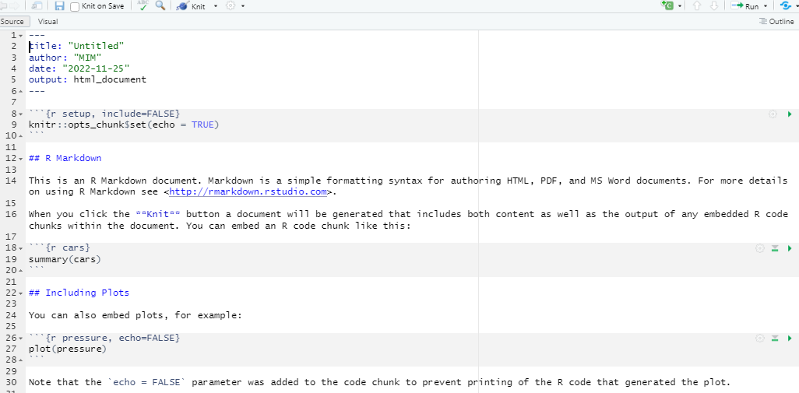

## We use the following packages
```{r, message=FALSE, warning=FALSE}
library(mice)     # Boys dataset
library(tidyverse)# All the good stuff
library(ggplot2)  # Plotting suite (actually included in tidyverse)
```

## Why visualise?

- We can process a lot of information quickly with our eyes
- Plots give us information about
    - Distribution / shape
    - Irregularities
    - Assumptions
    - Intuitions
- Summary statistics, correlations, parameters, model tests, *p*-values do not tell the whole story

## Why visualise?

</img>


<p style="text-align:center;font-style:italic;font-size:0.5em;">Source: https://www.autodeskresearch.com/publications/samestats</p>


# ggplot2

## What is `ggplot2`?
Layered plotting based on the book **The Grammar of Graphics** by Leland Wilkinsons.

With `ggplot2` you

1. provide the _data_
2. define how to map variables to _aesthetics_
3. state which _geometric object_ to display
4. (optional) edit the overall _theme_ of the plot

`ggplot2` then takes care of the details

The package is extremely popular and well described.

## An example: scatterplot

1: Provide the data
```{r, eval=FALSE}
boys |> 
  ggplot()
```

2: state which geometric object to display
```{r, eval=FALSE}
boys |> 
  ggplot() |> 
  geom_point()
```

3: map variable to aesthetics
```{r, eval=FALSE}
boys |> 
  ggplot() +
  geom_point(aes(x = hgt, y = wgt)
```

## An example: scatterplot
```{r, echo=FALSE, fig.align='center'}
boys |> 
  ggplot() +
  geom_point(aes(x = hgt, y = wgt),
             na.rm = TRUE)
```

## Why this syntax?

Create the plot
```{r, fig.align='center', dev.args=list(bg="transparent"), warning=FALSE, message=FALSE}
gg <-  boys |> 
  ggplot() +
  geom_point(aes(x=hgt, y=wgt),
             col="dark green" )
```

Add another layer (smooth fit line)
```{r, warning=FALSE, message=FALSE, fig.align='center', dev.args=list(bg="transparent")}
gg <- gg + 
  geom_smooth(aes(x = hgt, y = wgt),
              col = "dark blue")
```

Give it some labels and a nice look
```{r, fig.align='center', dev.args=list(bg="transparent")}
gg <- gg + 
  labs(x = "Age", y = "BMI", title = "BMI trend for boys") +
  theme_minimal()
```

## Why this syntax?
```{r, warning=FALSE, message=FALSE, fig.align='center', dev.args=list(bg="transparent")}
plot(gg)
```

## Aesthetics

- x
- y
- size
- colour
- fill
- opacity (alpha)
- linetype
- ...

## Aesthetics
```{r, warning=FALSE, message=FALSE, fig.align='center', dev.args=list(bg="transparent")}
gg <- boys |>  
  filter(!is.na(reg)) |>  
  ggplot() +
  
  geom_point(aes(x = hgt, 
                 y = wgt, 
                 shape  = reg, 
                 colour = age),
             alpha = 0.5) +
  labs(title  = "Trend for boys",
       x      = "Height", 
       y      = "Weight", 
       shape    = "Region",
       colour = "Age") +
  theme_minimal()
```
 
## Aesthetics
```{r, warning=FALSE, message=FALSE, fig.align='center', dev.args=list(bg="transparent")}
plot(gg)
```

## Geoms

- geom_point
- geom_bar
- geom_line
- geom_smooth

- geom_histogram
- geom_boxplot
- geom_density

## Geoms: Bar
```{r, echo=FALSE, warning=FALSE, message=FALSE, fig.align='center', dev.args=list(bg="transparent")}
data.frame(x = letters[1:5], y = c(1, 3, 3, 2, 1)) %>% 
  ggplot() + 
  geom_bar(aes(x = x, y = y),
           fill = "dark green", stat = "identity") +
  labs(title = "Value per letter",
       x     = "Letter", 
       y     = "Value") +
  theme_minimal()
```

## Geoms: Line
```{r, echo=FALSE, warning=FALSE, message=FALSE, fig.align='center', dev.args=list(bg="transparent")}
ggdat <- data.frame(x = 1:100, y = rnorm(100))
ggdat |>  
  ggplot(aes(x = x, y = y)) + 
  geom_line(colour = "dark green", lwd = 1) +
  ylim(-2, 3.5) +
  labs(title = "Some line thing",
       x     = "Time since start", 
       y     = "Some value") +
  theme_minimal()
```

## Geoms: Smooth
```{r, echo=FALSE, warning=FALSE, message=FALSE, fig.align='center', dev.args=list(bg="transparent")}
ggdat %>% 
  ggplot(aes(x = x, y = y)) + 
  geom_smooth(colour = "dark green", lwd = 1, se = FALSE) +
  ylim(-2, 3.5) +
  labs(title = "Another line thing",
       x     = "Time since start", 
       y     = "Some value") +
  theme_minimal()
```

## Geoms: Boxplot
```{r, echo=FALSE, warning=FALSE, message=FALSE, fig.align='center', dev.args=list(bg="transparent")}
boys %>% 
  filter(!is.na(reg)) %>% 
  
  ggplot(aes(x = reg, y = bmi, fill = reg)) +
  
  geom_boxplot() +
  
  labs(title = "BMI across regions",
       x     = "Region", 
       y     = "BMI") +
  theme_minimal() + 
  theme(legend.position = "none")
```

## Export figure

Easy with `ggsave()`

```{r, eval=FALSE}
# save as pdf
ggssave("plot.pdf", myplot)

# save as png and specify dimensions 
ggssave("plot.png", myplot, width = 7, height = 5, units="in")
```

# RMarkdown

```{r, include = F}

library(tidyverse)
library(knitr)
library(kableExtra)
library(mice)   

inline <- function(x = "") paste0("`` `r ", x, "` ``")

#knitr::opts_chunk$set(message = F, echo = F)
dt <- mtcars[1:5, 1:6]

options("kableExtra.html.bsTable" = T) #For kableExtra with ioslides

```

## R Markdown

**What is it**  
* R Markdown is a file format for making dynamic documents

**Who is it for**  
* For communicating to decision makers, who want to focus on the conclusions, not the code behind the analysis.

* For collaborating with other data scientists (including future you!), who are interested in both your conclusions, and how you reached them (i.e. the code).

*  As an environment in which to do data science, as a modern day lab notebook where you can capture not only what you did, but also what you were thinking.

## Types of R Markdown output

-   Documents (HTML, PDF, Word, RTF, Markdown)
-   Presentations
    -   ioslides (HTML)
    -   Beamer (PDF)
    -   PowerPoint (PowerPoint)
-   Journals
    -   elsevier_article \_ jss_article
-   Dashboards
    -   Flexdashboard
-   Websites and blogs
    -   blogdown
-   Books
    -   bookdown (HTML, PDF, ePUB and Kindle books)

## Start a new Markdown-document

To create a new document:  
 - File
 - New File
 - RMarkdown  
You can create a title and an output-format and then RStudio sets up the basics for you.

## R Markdown code

<center></center>

## What does R Markdown contains

It contains three important types of content:

-   An (optional) YAML header surrounded by ---s.
-   Chunks of R code surrounded by \`\`\`.
-   Text mixed with simple text formatting like \# heading and *italics*.

## How does R Markdown works

<center></center>

<br><br><br><br> <br><br><br><br>

...but just push (ctrl+shift+K) the Knit icon.

# YAML

## YAML

YAML - "yet another markup language"

-   Controls many "whole document" settings
-   Possible to set document parameters
-   Possible to specify bibliography

RStudio creates a YAML header when starting from scratch with *File* $\rightarrow$ New File $\rightarrow$ R Markdown...

# Text

## Text

Examples

-   \*italic\* gives *italic*

-   \*\*bold\*\* gives **bold**

-   \~\~Strikethrough\~\~ gives ~~Strikethrough~~

-   superscript\^2\^subscript\~2\~ gives superscript^2^/subscript~2~

-   \$e\^{i\\pi}+1=0\$ gives $e^{i\pi}+1=0$

-   `r inline('nrow(mice::boys)')` gives `r nrow(mice::boys)`

-   Headers:

-   \# Level 1 header

-   \## Level 2 header

## Lists

`* Blah Blah`\
`* Blah`

gives

-   Blah Blah\
-   Blah

`1. Blah Blah`\
`2. Blah`

gives

1.  Blah Blah\
2.  Blah

# Code chunks
## Creating a code chunk
To integrate `R` code into your document you create a code chunk (Short cut Ctrl+Alt+i).  
By default it will show both your code and the result from the console.
So the following codechunk in your Rmarkdown file:
````{verbatim}
```{r}
a <- 100
a*2
```
````

## Creating a code chunk
Will be printed in your document as:
```{r}
a <- 100
a*2
```

## Creating a code chunk
When writing your Rmarkdown-file you can run each line in your chunk with Ctrl+Enter or the entire chunk with Ctrl+Shift+Enter


## Tables - (normal print)

Printing tables to markdown aren't pretty. But with the package *kableExtra* it is easy to make readable tabels.

```{r}
boys |>  
select(-gen, -phb, -tv) |> 
head()
```

## Tables - `knitr::kable`

```{r}
boys |>  
select(-gen, -phb, -tv, -hc) |> 
head() |> 
knitr::kable(format = "html",
col.names = c("Age","Height","Weight","BMI", "Region"),
align = "ccccc",
caption = "The 5 first boys")
```

## Tables - `knitr::kable` and `KableExtra`

```{r results='asis'}
boys |>  
  select(-gen, -phb, -tv, -hc) |> 
  head() |> 
  knitr::kable(col.names = c("Age","Height","Weight","BMI", "Region"),
               align = "ccccc",
               caption = "The 5 first boys") |>  
  kable_styling(bootstrap_options = c("hover"),
                full_width = FALSE, position = "left") 
```

## Figures
Rmarkdown will notice when a code chunk produces a figure. 
```{r eval = F}
boys |> 
  ggplot() +
  geom_point(aes(x = age,
                 y = hgt))
```

## Figures
```{r echo = F}
boys |> 
  ggplot() +
  geom_point(aes(x = age,
                y = hgt))
```

## Chunk options
Sometimes you do not want to show your code, but only your results. Then you can use a chunk option.  
The option that hides the code in the output is called `echo`
````{verbatim}
```{r echo = F}
a <- 100
a*2
```
````
```{r echo = F}
a <- 100
a*2
```

## Chunk options
`x` marks the thing that the chunk will **not** do
```{r echo = F}
include_graphics("figures/Options.png")
```


## Good resources to learn more
**RMarkdown**

 - [Rmarkdown - An introduction](https://rmarkdown.rstudio.com/lesson-1.html): A short userfriendly introduction to Rmarkdown with videos and examples.
 - [Rmarkdown - Cheat sheet](https://github.com/rstudio/cheatsheets/raw/main/rmarkdown-2.0.pdf): A handy cheat sheet
 - [Rmarkdown - The definitive guide](https://bookdown.org/yihui/rmarkdown/): A very thorough look at RMarkdown. No need to read everything, but if there is a subject you struggle with, tak a look at the index.
 
 
**ggplot2**

 - [ggplot2 - The book](https://ggplot2-book.org/): The ultimate guide to `ggplot` written by Hadley Wickham who is also the author to the package. It is quite long, but if you want to truely understand it, this is the place to start.
 - [ggplot2 - Cheat sheet](https://posit.co/wp-content/uploads/2022/10/data-visualization-1.pdf): A very useful cheat sheet
 - [sf - Maps in ggplot2](https://r-spatial.github.io/sf/): sf is a package that extends `ggplot2` so it can make maps  
 
## Final note
 
- If you want to learn more about everything we have looked at the best place to
 go is probable the online-book *R for Datascience*.  
- It is free and written by Hadley Wickham, who is the main author behind `tidyverse`.  
- You can find it here: [r4ds.had.co.nz/](https://r4ds.had.co.nz/)

```{r echo = F}
include_graphics("figures/cover.png")
```
 
# Practical